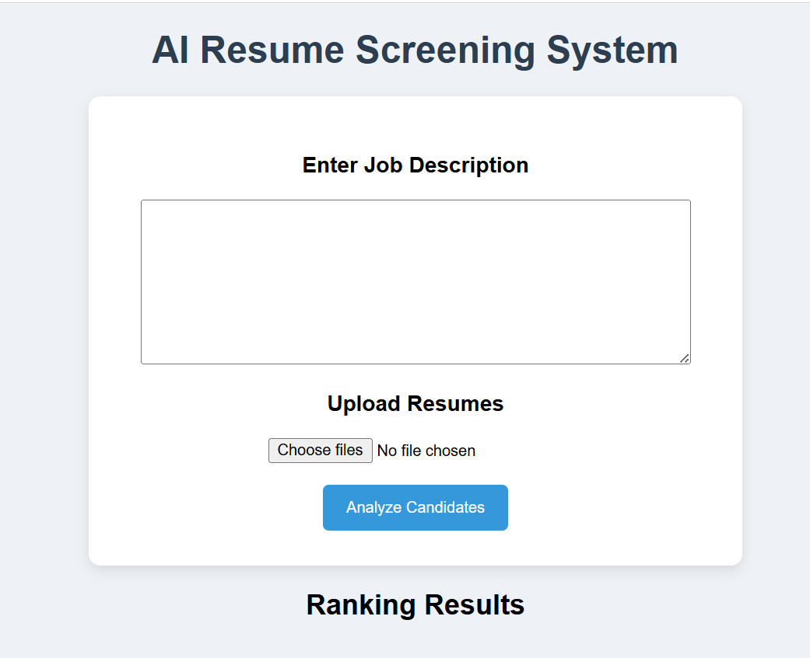

# 🤖 AI Resume Screening System


---

# 📌 Project Overview

The **AI Resume Screening System** is a full‑stack web application that helps recruiters automatically analyze and rank resumes based on their relevance to a given job description.

The system uses **Natural Language Processing (NLP)** and **semantic similarity techniques** to compare candidate resumes with job requirements and generate a ranked list of candidates.

This project simulates a simplified **Applicant Tracking System (ATS)** used by modern companies to speed up the candidate shortlisting process.

It demonstrates integration of:

* Frontend development (**HTML, CSS, JavaScript**)
* Backend API development using **FastAPI**
* **NLP embeddings** for resume similarity
* **PDF resume parsing**
* Client–server communication

---

# 🖥️ Demo

## Resume Ranking Interface

Here is the screenshot of the UI of the project:

<p align="center">
  
</p>

---

# 🚀 Features

### 📄 Resume Upload

Upload one or multiple resumes in **PDF format**.

### 📝 Job Description Input

Recruiters can enter a job description or role requirements.

### 🧠 AI‑Based Resume Analysis

Uses **Sentence Transformers** to convert resume and job description text into semantic embeddings.

### 📊 Automatic Candidate Ranking

Resumes are ranked based on **semantic similarity scores**.

### 📈 Clean Dashboard Interface

Results are displayed in a simple and readable UI showing candidate ranking and match score.

---

# 🏗️ System Architecture

```
        +----------------------+
        |     Frontend UI      |
        |  HTML / CSS / JS    |
        +----------+-----------+
                   |
                   |
                   v
        +----------------------+
        |     FastAPI API      |
        |    Backend Server    |
        +----------+-----------+
                   |
                   |
                   v
        +----------------------+
        |     NLP Model        |
        | SentenceTransformers |
        +----------+-----------+
                   |
                   |
                   v
        +----------------------+
        |   Resume Ranking     |
        | Similarity Scoring   |
        +----------------------+
```

---

# 🧰 Technology Stack

## Frontend

* HTML
* CSS
* JavaScript

## Backend

* FastAPI
* Uvicorn

## AI / NLP

* Sentence Transformers
* Cosine Similarity

## File Processing

* PyPDF2

---

# 📁 Project Structure

```
AI-Resume-Screener
│
├── backend
│   ├── main.py
│   └── requirements.txt
│
├── frontend
│   ├── index.html
│   ├── style.css
│   └── script.js
│
├── screenshots
│   └── app_ui.png
│
└── README.md
```

---

# ⚙️ Installation & Setup

## 1️⃣ Clone the Repository

```
git clone https://github.com/your-username/AI-Resume-Screener.git
cd AI-Resume-Screener
```

---

## 2️⃣ Install Dependencies

Install required Python libraries:

```
pip install -r backend/requirements.txt
```

---

## 3️⃣ Run the Backend Server

Navigate to the backend folder and start the FastAPI server:

```
cd backend
uvicorn main:app --reload
```

The API will run at:

```
http://127.0.0.1:8000
```

Interactive API documentation:

```
http://127.0.0.1:8000/docs
```

---

## 4️⃣ Run the Frontend

Open the frontend page in your browser:

```
frontend/index.html
```

Upload resumes and enter a job description to analyze candidates.

---

# 📊 Example Output

Example ranking result:

```
Rank 1 : Candidate_A.pdf
Score  : 0.87

Rank 2 : Candidate_B.pdf
Score  : 0.74

Rank 3 : Candidate_C.pdf
Score  : 0.62
```

---

# 📊 Example Workflow

1. The recruiter enters a **job description**.
2. Multiple **candidate resumes** are uploaded.
3. The frontend sends the data to the **FastAPI backend**.
4. Backend extracts text from PDF resumes.
5. The NLP model converts text to **vector embeddings**.
6. **Cosine similarity** compares resume embeddings with job description embeddings.
7. Candidates are **ranked by similarity score**.
8. Results are displayed in the frontend dashboard.

---

# 🌍 Real‑World Applications

This system can be used for:

* Resume shortlisting for recruiters
* Applicant Tracking Systems (ATS)
* HR automation tools
* AI‑powered recruitment platforms
* Talent analytics systems

---

# 🔮 Future Improvements

Potential enhancements include:

* 🔎 Skill extraction from resumes
* 📉 Missing skills detection
* 📊 Visualization dashboards with charts
* 🤖 AI feedback for candidates
* ☁️ Cloud deployment
* 📄 Support for DOCX resumes
* 🧾 Resume ATS scoring

---

# 📚 Learning Outcomes

Through this project, the following concepts are demonstrated:

* Full‑stack web development
* REST API design
* Natural Language Processing
* Transformer embeddings
* File parsing and processing
* Client–server architecture

